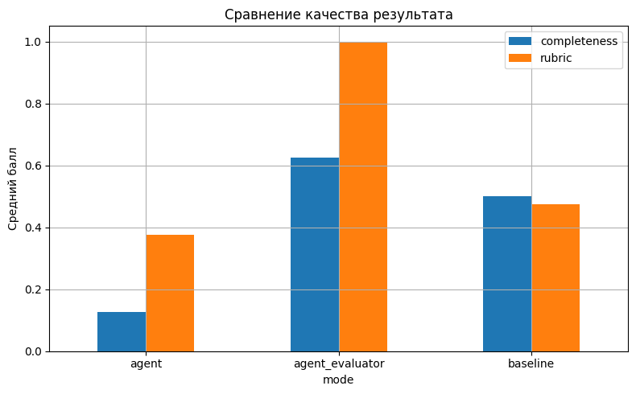
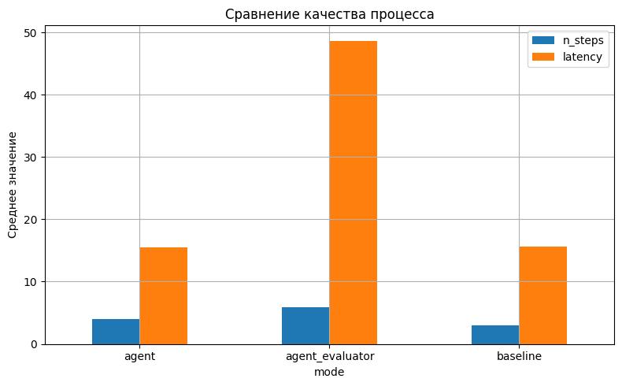
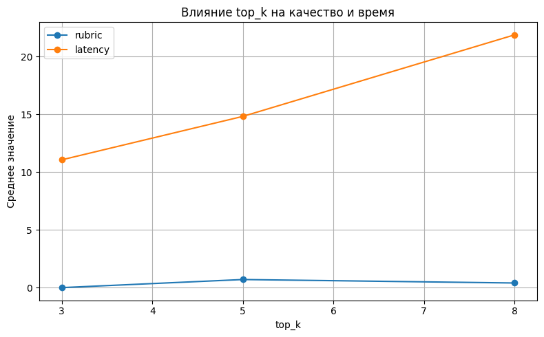
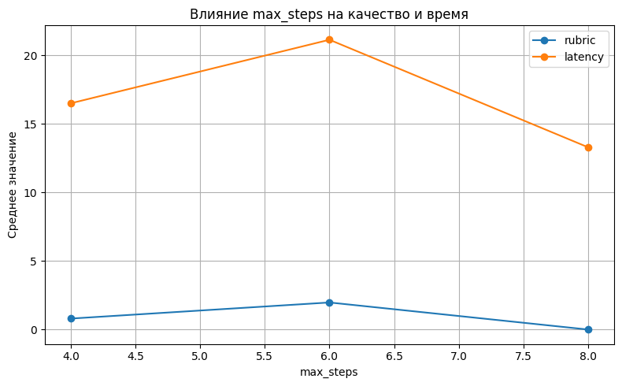

# **Отчет по лабораторной работе 3.**
## Агентный искусственный интеллект для научно-информационного поиска

---

## 1. Определение

В данной лабораторной работе исследуется агентный подход к решению задачи научно-информационного поиска и подготовки структурированного обзора по заданной теме.

Агентная система отличается от базового LLM-режима тем, что решает задачу не одним вызовом модели, а как последовательность шагов: получает цель, хранит состояние, вызывает инструменты, анализирует промежуточные результаты, фиксирует trace и завершает выполнение по явному критерию остановки.

Цель эксперимента — сравнить три режима подготовки обзора:

1. `baseline` — базовый неагентный режим;
2. `agent` — агентный режим с инструментами;
3. `agent_evaluator` — агентный режим с дополнительной проверкой evaluator-компонентом.

Сравнение проводится не только по качеству итогового текста, но и по качеству процесса: числу шагов, количеству источников, задержке выполнения и согласованности ответа с найденными источниками.

---

## 2. Основные подходы

### 2.1. Постановка задачи

Система должна по формулировке темы подготовить краткий научно-аналитический обзор со следующей обязательной структурой:

- определение;
- основные подходы;
- 3–5 ключевых работ;
- применения;
- ограничения;
- использованные источники.

Минимальные требования к результату:

| Параметр | Значение |
|---|---:|
| Язык отчета | русский |
| Минимум ключевых работ | 3 |
| Максимум ключевых работ | 5 |
| Минимум источников | 3 |
| Количество тестовых тем | 8 |

---

### 2.2. Используемая модель и параметры вызова

В эксперименте использовался совместимый с OpenAI API интерфейс вызова модели.

| Параметр | Значение |
|---|---|
| Provider | `openai` |
| Base URL | `https://polza.ai/api/v1` |
| Model | `qwen/qwen3.5-35b-a3b` |
| Temperature | `0.2` |
| Timeout | `180` |
| Max tokens | `200` |
| API key env | `POLZA_AI_API_KEY` |

Низкое значение `temperature = 0.2` выбрано для уменьшения случайности генерации и повышения воспроизводимости ответов.

---

### 2.3. Используемые инструменты

В агентном режиме использовались следующие инструменты:

| Инструмент | Назначение |
|---|---|
| Wikipedia API | получение общего справочного контекста по теме |
| OpenAlex API | поиск научных публикаций |
| `invert_abstract` | восстановление текста аннотации из `abstract_inverted_index` |
| Evaluator | проверка итогового ответа по фиксированной рубрике |
| Trace logger | фиксация шагов, вызовов инструментов и причин переходов |

---

### 2.4. Структура состояния агента

Состояние агента хранит цель, историю действий, найденные источники, промежуточные заметки и статус выполнения.

```python
@dataclass
class AgentState:
    topic: str
    objective: str
    step_id: int = 0
    history: List[Dict[str, Any]] = field(default_factory=list)
    sources: List[Dict[str, Any]] = field(default_factory=list)
    notes: List[str] = field(default_factory=list)
    final_answer: str = ""
    status: str = "running"
    stop_reason: str = ""
```

После каждого действия в `history` записываются:

- номер шага;
- название действия;
- аргументы вызова;
- краткий результат;
- изменение состояния;
- причина перехода к следующему шагу.

---

### 2.5. Baseline-режим

Baseline-режим выполняет задачу в упрощенной форме:

1. получает тему;
2. извлекает общий справочный контекст;
3. сразу формирует итоговый ответ.

Главное ограничение baseline состоит в том, что он не выполняет полноценный поиск научных публикаций и не строит трассу рассуждений. Поэтому такой режим может быть быстрее и проще, но хуже контролируется по источникам.

---

### 2.6. Agent-режим

Agent-режим выполняет задачу как последовательность действий:

1. получает общий контекст через Wikipedia API;
2. ищет публикации через OpenAlex API;
3. отбирает найденные источники;
4. извлекает аннотации и формирует заметки;
5. генерирует итоговый структурированный обзор;
6. сохраняет trace выполнения.

Такой режим лучше соответствует требованиям лабораторной работы, потому что качество результата можно анализировать через траекторию выполнения.

---

### 2.7. Agent + evaluator

Режим `agent_evaluator` добавляет к агентному циклу отдельный этап оценки результата.

Evaluator проверяет ответ по критериям:

| Метрика | Смысл |
|---|---|
| `correctness` | фактическая корректность |
| `groundedness` | опора на найденные источники |
| `completeness` | полнота раскрытия темы |
| `coverage` | покрытие обязательных разделов |
| `source_consistency` | согласованность ответа с источниками |
| `rubric` | средняя итоговая оценка |

Добавление evaluator повышает качество результата, но увеличивает число шагов и задержку выполнения.

---

### 2.8. Тестовый набор тем

В эксперименте использовались восемь тем:

1. Agentic AI for customer support
2. Graph RAG for enterprise knowledge systems
3. LLM evaluation and process-aware metrics
4. Tool-using language models in scientific search
5. Retrieval-augmented generation in medicine
6. Planning and reflection in LLM agents
7. Human-in-the-loop AI systems
8. Knowledge graphs for procedural reasoning

---

### 2.9. Схема экспериментов

Были проведены следующие серии экспериментов:

| Эксперимент | Описание |
|---|---|
| Эксперимент 1 | Baseline на восьми темах |
| Эксперимент 2 | Agent без evaluator на восьми темах |
| Эксперимент 3 | Agent с evaluator на восьми темах |
| Эксперимент 4 | Сравнение agent при `top_k = 3, 5, 8` |
| Эксперимент 5 | Сравнение agent при `max_steps = 4, 6, 8` |

Основные параметры конфигурации:

| Параметр | Значение |
|---|---:|
| `default_top_k` | 5 |
| `default_max_steps` | 6 |
| `min_sources` | 3 |
| `output_dir` | `outputs` |
| `topics_path` | `data/topics.json` |

---

## 3. Ключевые работы

В рамках предметной области лабораторной работы можно выделить следующие ключевые направления и работы.

| № | Работа / направление | Значение для лабораторной |
|---:|---|---|
| 1 | Retrieval-Augmented Generation, Lewis et al. | Задает общий подход к генерации ответа с использованием внешних источников |
| 2 | ReAct: Reasoning and Acting in Language Models, Yao et al. | Показывает схему совмещения рассуждения и действий агента |
| 3 | Toolformer, Schick et al. | Описывает идею использования инструментов языковыми моделями |
| 4 | Reflexion, Shinn et al. | Связана с самопроверкой, рефлексией и улучшением траектории агента |
| 5 | LLM-as-a-Judge / evaluator-подходы | Используются для автоматизированной оценки качества итогового ответа |

Эти работы связаны с основными компонентами реализованного решения: retrieval, tool use, agent trace, reflection/evaluation и grounding.

---

## 4. Применения

Реализованный подход применим в задачах, где требуется не просто сгенерировать текст, а собрать, проверить и структурировать информацию из нескольких источников.

Возможные применения:

| Область | Пример использования |
|---|---|
| Научный поиск | подготовка кратких обзоров по исследовательским темам |
| Корпоративные базы знаний | поиск и обобщение информации из внутренних документов |
| Медицина | обзор публикаций и клинических направлений при обязательной проверке источников |
| Поддержка клиентов | агентный поиск по документации и базе знаний |
| Образование | подготовка учебных справок с источниками |
| Аналитика | сравнение подходов, методов и публикаций по заданной теме |

---

## 5. Экспериментальные результаты

### 5.1. Сводная таблица по режимам

| mode | correctness | groundedness | completeness | coverage | source_consistency | rubric | n_steps | n_sources | latency |
|---|---:|---:|---:|---:|---:|---:|---:|---:|---:|
| agent | 0.375 | 0.500 | 0.125 | 0.250 | 0.625 | 0.375 | 4.000 | 8.0 | 15.542 |
| agent_evaluator | 1.000 | 1.250 | 0.625 | 0.875 | 1.250 | 1.000 | 5.875 | 8.0 | 48.670 |
| baseline | 1.125 | 0.000 | 0.500 | 0.750 | 0.000 | 0.475 | 3.000 | 0.0 | 15.626 |

По итоговой метрике `rubric` лучший режим — `agent_evaluator`, получивший среднюю оценку `1.000`.

При этом baseline имеет чуть более высокую среднюю `correctness`, чем `agent_evaluator`, но полностью проигрывает по `groundedness` и `source_consistency`, потому что не использует найденные научные источники.

---

### 5.2. Компактное сравнение качества и процесса

| mode | completeness | rubric | n_steps | latency |
|---|---:|---:|---:|---:|
| agent | 0.125 | 0.375 | 4.000 | 15.542 |
| agent_evaluator | 0.625 | 1.000 | 5.875 | 48.670 |
| baseline | 0.500 | 0.475 | 3.000 | 15.626 |

Основные наблюдения:

- `agent_evaluator` дает лучший итоговый `rubric`;
- `agent` формально оказался самым быстрым, но разница с baseline минимальна: `15.542` сек против `15.626` сек;
- baseline требует меньше всего шагов: `3.000`;
- `agent_evaluator` увеличивает качество, но делает это ценой роста latency и числа шагов.

---

### 5.3. Сравнение по темам

| topic | agent | agent_evaluator | baseline |
|---|---:|---:|---:|
| Agentic AI for customer support | 0.0 | 3.2 | 1.4 |
| Graph RAG for enterprise knowledge systems | 0.0 | 0.0 | 0.0 |
| Human-in-the-loop AI systems | 0.0 | 0.0 | 0.0 |
| Knowledge graphs for procedural reasoning | 0.0 | 0.0 | 0.0 |
| LLM evaluation and process-aware metrics | 0.0 | 4.8 | 0.0 |
| Planning and reflection in LLM agents | 3.0 | 0.0 | 0.0 |
| Retrieval-augmented generation in medicine | 0.0 | 0.0 | 2.4 |
| Tool-using language models in scientific search | 0.0 | 0.0 | 0.0 |

Таблица показывает, что качество распределено неравномерно по темам. Особенно заметны три случая:

1. `LLM evaluation and process-aware metrics` — режим `agent_evaluator` дал высокий результат `4.8`, тогда как baseline и agent без evaluator получили `0.0`.
2. `Planning and reflection in LLM agents` — обычный `agent` получил `3.0`, но `agent_evaluator` и baseline не дали качественного результата.
3. `Retrieval-augmented generation in medicine` — baseline получил `2.4`, тогда как агентные режимы получили `0.0`.

Это означает, что преимущество агентной архитектуры не является автоматическим. Качество зависит от поиска, релевантности источников, корректности промежуточных заметок и устойчивости evaluator-процедуры.

---

## 6. Графики

Все графики предполагается сохранить в директорию:

```text
outputs/figures
```

### 6.1. Список графиков и имена файлов

| № | Название графика | Файл |
|---:|---|---|
| 1 | Сравнение качества результата: completeness и rubric по режимам | `outputs/figures/01_quality_result_comparison.png` |
| 2 | Сравнение качества процесса: число шагов и latency по режимам | `outputs/figures/02_process_quality_comparison.png` |
| 3 | Влияние числа источников top_k на качество и время | `outputs/figures/03_topk_quality_latency.png` |
| 4 | Влияние ограничения max_steps на качество и время | `outputs/figures/04_max_steps_quality_latency.png` |

---

### Рисунок 1 — Сравнение качества результата: completeness и rubric по режимам



График показывает, что `agent_evaluator` превосходит остальные режимы по `completeness` и итоговой метрике `rubric`. Обычный `agent` показал худшую полноту ответа, несмотря на использование источников.

---

### Рисунок 2 — Сравнение качества процесса: число шагов и latency по режимам



График показывает различие между качеством результата и стоимостью процесса. `agent_evaluator` требует больше шагов и имеет значительно большую задержку, но обеспечивает лучший итоговый результат. Baseline выполняется с минимальным числом шагов, но не обеспечивает grounding.

---

### Рисунок 3 — Влияние числа источников top_k на качество и время



Результаты факторного эксперимента по `top_k`:

| top_k | rubric | latency |
|---:|---:|---:|
| 3 | 0.0 | 11.055 |
| 5 | 0.7 | 14.812 |
| 8 | 0.4 | 21.862 |

Лучшее значение `rubric` получено при `top_k = 5`. При `top_k = 3` источников недостаточно, поэтому качество падает до нуля. При `top_k = 8` latency растет, но качество не улучшается, что может указывать на добавление нерелевантных или избыточных источников.

---

### Рисунок 4 — Влияние ограничения max_steps на качество и время



Результаты факторного эксперимента по `max_steps`:

| max_steps | rubric | latency |
|---:|---:|---:|
| 4 | 0.800 | 16.507 |
| 6 | 1.975 | 21.145 |
| 8 | 0.000 | 13.295 |

Лучшее качество получено при `max_steps = 6`. При `max_steps = 4` агенту, вероятно, не хватает шагов для полного поиска и проверки. При `max_steps = 8` качество резко падает, что может означать деградацию траектории: лишние шаги, неудачные переформулировки или накопление нерелевантного контекста.

---

## 7. Интерпретация качества результата и качества процесса

В лабораторной работе важно разделять два типа качества:

1. качество итогового ответа;
2. качество процесса выполнения.

### 7.1. Качество итогового ответа

По итоговому `rubric` режимы расположились следующим образом:

| Режим | rubric |
|---|---:|
| agent_evaluator | 1.000 |
| baseline | 0.475 |
| agent | 0.375 |

`agent_evaluator` оказался лучшим по итоговой оценке, потому что он улучшил:

- `groundedness`: `1.250` против `0.000` у baseline;
- `completeness`: `0.625` против `0.500` у baseline и `0.125` у agent;
- `coverage`: `0.875` против `0.750` у baseline;
- `source_consistency`: `1.250` против `0.000` у baseline.

Таким образом, evaluator повысил качество не за счет скорости, а за счет лучшей проверки структуры, полноты и связи ответа с источниками.

---

### 7.2. Качество процесса

По процессным метрикам ситуация другая:

| Режим | n_steps | latency |
|---|---:|---:|
| baseline | 3.000 | 15.626 |
| agent | 4.000 | 15.542 |
| agent_evaluator | 5.875 | 48.670 |

Baseline требует меньше всего шагов, но не собирает источники. Обычный `agent` использует больше шагов, однако это не привело к росту итогового качества. Режим `agent_evaluator` требует больше шагов и выполняется значительно дольше, но именно он дает лучший результат.

Разница между `agent_evaluator` и `agent`:

| Метрика | Разница |
|---|---:|
| rubric | +0.625 |
| latency | +33.128 сек |
| n_steps | +1.875 |

Следовательно, улучшение качества сопровождается существенным ростом вычислительной стоимости.

---

## 8. Анализ ошибок и неудачных траекторий

### 8.1. Graph RAG for enterprise knowledge systems

Во всех режимах получено значение `0.0`.

Возможные причины деградации:

- поисковый запрос слишком специализированный;
- найденные источники могли быть нерелевантны;
- модель могла не извлечь различие между Graph RAG, knowledge graphs и enterprise search;
- итоговый ответ мог не покрыть обязательные разделы.

Тип ошибки: слабый поиск и потеря полноты.

---

### 8.2. Planning and reflection in LLM agents

Для этой темы обычный `agent` получил `3.0`, а `agent_evaluator` и baseline — `0.0`.

Возможные причины:

- agent без evaluator смог подобрать релевантные источники и сформировать приемлемый обзор;
- evaluator-режим мог ухудшить результат из-за неудачной проверки, слишком жесткой оценки или сбоя в финальной генерации;
- baseline без источников не смог раскрыть тему достаточно полно.

Тип ошибки: нестабильность evaluator-контура и чувствительность к траектории.

---

### 8.3. Retrieval-augmented generation in medicine

Baseline получил `2.4`, а агентные режимы — `0.0`.

Возможные причины:

- общая справочная информация могла оказаться достаточно хорошей для baseline;
- агентный поиск мог вернуть слишком широкие или нерелевантные публикации;
- медицинская тематика требует более точной фильтрации источников;
- найденные источники могли не быть корректно связаны с итоговым ответом.

Тип ошибки: нерелевантный retrieval и недостаточная source consistency.

---

### 8.4. Tool-using language models in scientific search

Все режимы получили `0.0`.

Возможные причины:

- тема объединяет сразу несколько аспектов: tool use, LLM agents, scientific search;
- поисковые запросы могли быть слишком широкими;
- система могла не найти 3–5 ключевых работ;
- итоговый ответ мог не соответствовать требуемой структуре.

Тип ошибки: слабое покрытие темы и отсутствие устойчивого поиска.

---

## 9. Ограничения

Основные ограничения реализованного решения:

1. **Низкие абсолютные оценки.** Даже лучший режим `agent_evaluator` получил средний `rubric = 1.000`, что показывает необходимость доработки поиска, промптов и процедуры отбора источников.

2. **Высокая latency evaluator-режима.** `agent_evaluator` выполняется в среднем `48.670` сек, что примерно на `33.128` сек дольше обычного `agent`.

3. **Неустойчивость по темам.** На части тем все режимы получили `0.0`, что указывает на нестабильность поиска и генерации.

4. **Недостаточная полнота agent-режима.** Обычный `agent` имеет `completeness = 0.125`, хотя использует в среднем 8 источников. Это означает, что сам факт retrieval не гарантирует качественный итоговый ответ.

5. **Baseline не обеспечивает groundedness.** У baseline `groundedness = 0.000` и `source_consistency = 0.000`, потому что он не использует полноценный набор научных источников.

6. **Рост числа шагов не всегда улучшает качество.** В эксперименте с `max_steps = 8` качество упало до `0.000`, что показывает риск деградации при слишком длинной траектории.

7. **Чувствительность к `top_k`.** При `top_k = 3` источников недостаточно, а при `top_k = 8` растет задержка и может добавляться шум. Лучший результат в эксперименте получен при `top_k = 5`.

---

## 10. Итоговый вывод

В работе было проведено сравнение baseline, agent и agent + evaluator для задачи подготовки структурированного научно-аналитического обзора.

Лучшим режимом по итоговой экспертной метрике `rubric` оказался `agent_evaluator` со значением `1.000`. Он оказался лучше не потому, что был быстрее или короче по траектории, а потому что обеспечил более высокую полноту, лучший grounding и лучшую согласованность ответа с источниками.

Baseline оказался самым простым по процессу: он использует минимальное число шагов — `3.000`. Однако его ключевой недостаток состоит в отсутствии полноценной опоры на найденные источники: `groundedness = 0.000`, `source_consistency = 0.000`. Поэтому baseline может давать внешне приемлемые ответы, но хуже соответствует требованиям научно-информационного поиска.

Обычный `agent` использовал источники и в среднем находил `8` публикаций, но не смог стабильно преобразовать retrieval в качественный итоговый ответ. Его `rubric = 0.375`, что ниже baseline. Это показывает, что агентная архитектура сама по себе не гарантирует улучшения: важны качество поиска, отбор источников, структура состояния, промпт финальной генерации и контроль полноты.

Добавление evaluator улучшило результат: по сравнению с обычным agent итоговый `rubric` вырос на `0.625`. Но это сопровождалось ростом latency на `33.128` сек и увеличением числа шагов на `1.875`.

Таким образом, наиболее качественным вариантом является `agent_evaluator`, потому что он лучше контролирует полноту ответа, связь с источниками и выполнение обязательной структуры. Однако с эксплуатационной точки зрения этот режим дороже: он медленнее и требует большего числа шагов. Для практического применения оптимальной выглядит конфигурация agent + evaluator при ограничении `top_k = 5` и `max_steps = 6`, так как именно эти значения дали лучший баланс между качеством и стоимостью процесса.

---

## 11. Использованные источники

1. Методические материалы лабораторной работы «Агентный искусственный интеллект».
2. Экспериментальные результаты из файлов:
   - `outputs/results/summary.csv`;
   - `outputs/results/baseline_records.csv`;
   - `outputs/results/agent_records.csv`;
   - `outputs/results/agent_evaluator_records.csv`;
   - `outputs/results/topk_experiment.csv`;
   - `outputs/results/max_steps_experiment.csv`.
3. Конфигурация тем: `data/topics.json`.
4. OpenAlex API — источник метаданных научных публикаций.
5. Wikipedia REST API — источник общего справочного контекста.
6. Lewis et al. — Retrieval-Augmented Generation for Knowledge-Intensive NLP Tasks.
7. Yao et al. — ReAct: Synergizing Reasoning and Acting in Language Models.
8. Schick et al. — Toolformer: Language Models Can Teach Themselves to Use Tools.
9. Shinn et al. — Reflexion: Language Agents with Verbal Reinforcement Learning.
10. Работы по LLM-as-a-Judge и evaluator-подходам для автоматизированной оценки ответов.